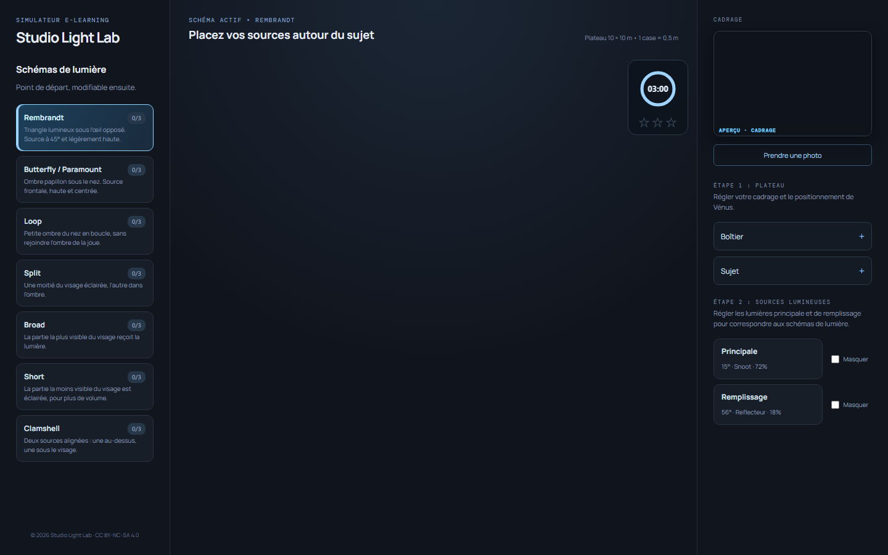

# Studio Light Lab

Apprenez les principaux schémas d'éclairage photographique en explorant un plateau virtuel en 3D : placez votre caméra, positionnez votre sujet, composez la lumière, puis observez le résultat comme si vous étiez derrière l'appareil. Et prenez même une photo de rendu !

Learn the key photographic lighting patterns by exploring a virtual 3D stage: place your camera, position your subject, shape the light, then see the result as if you were behind the lens. You can even take a render photo!



---

## Français

### Qu'est-ce que c'est ?

Studio Light Lab est une simulation e-learning. Vous explorez librement les schémas de lumière classiques du portrait : **Rembrandt, Butterfly, Loop, Split, Broad, Short et Clamshell**.

### Comment l'utiliser ?

1. **Choisissez un schéma** de lumière dans la colonne de gauche (Rembrandt, Butterfly, Loop, Split…).
2. **Étape 1 — Cadrage** : réglez la position de Vénus (avancer/reculer, orientation) et votre boîtier (distance, hauteur, focale).
3. **Étape 2 — Sources lumineuses** : ouvrez la principale et le remplissage, ajustez angle, distance, hauteur, puissance, modeleur et même la couleur.
4. **Aperçu** : gardez un œil en direct dans l'aperçu et cliquez sur **« Prendre une photo »** pour télécharger le rendu (1920 × 1280).
5. **Questions** : toutes les 3 minutes, une question liée au schéma en cours (oui/non, choix unique ou multiple). Une bonne réponse éclaire une **étoile** — 3 étoiles par schéma. Les questions s'arrêtent à 3 bonnes réponses.
6. **Le saviez-vous ?** : de petites infos pédagogiques apparaissent en haut à gauche de la scène tout au long du parcours.

**Résultats** : le bloc « Résultats » dans la colonne de gauche s'affiche dès la première réponse. La fenêtre de **fin de parcours** s'ouvre automatiquement quand les 7 schémas ont leurs 3 étoiles (21/21).

### Lancer le projet

**Option A — Démo déjà construite (aucune installation)**
Ouvrez `index.html` du dossier `dist/` derrière un petit serveur statique, ou hébergez le dossier `dist/` sur n'importe quel hébergement statique (Netlify, Vercel, GitHub Pages, nginx…). Pour GitHub Pages, un workflow `.github/workflows/deploy.yml` est inclus : poussez sur `main` et activez Pages (Source : GitHub Actions).

**Option B — Développement avec Docker**
```bash
docker compose up --build
```
Puis ouvrez http://localhost:5173.

**Option C — Développement sans Docker**
```bash
npm install
npm run dev
```

---

## English

### What is it?

Studio Light Lab is an e-learning simulation. You freely explore the classic portrait lighting patterns: **Rembrandt, Butterfly, Loop, Split, Broad, Short and Clamshell**.

### How to use it?

1. **Choose a lighting pattern** from the left column (Rembrandt, Butterfly, Loop, Split…).
2. **Step 1 — Framing**: adjust the position of Venus (forward/back, orientation) and your camera body (distance, height, focal length).
3. **Step 2 — Light sources**: open the key and fill lights, and tweak angle, distance, height, power, modifier and even color.
4. **Preview**: watch the result live in the preview and click **"Take a photo"** to download the render (1920 × 1280).
5. **Questions**: every 3 minutes, a question tied to the current pattern (yes/no, single or multiple choice). A correct answer lights up a **star** — 3 stars per pattern. Questions stop after 3 correct answers.
6. **Did you know?**: small educational tips appear at the top-left of the 3D scene throughout the course.

**Results**: the "Results" block in the left column appears after your first answer. The **end-of-course** window opens automatically once all 7 patterns have their 3 stars (21/21).

### Running the project

**Option A — Prebuilt demo (no install)**
Open `index.html` from the `dist/` folder behind a small static server, or host the `dist/` folder on any static host (Netlify, Vercel, GitHub Pages, nginx…). For GitHub Pages, a `.github/workflows/deploy.yml` workflow is included: push to `main` and enable Pages (Source: GitHub Actions).

**Option B — Development with Docker**
```bash
docker compose up --build
```
Then open http://localhost:5173.

**Option C — Development without Docker**
```bash
npm install
npm run dev
```

---

## Tech / Technique (résumé)

- **React + TypeScript + Vite** pour l'interface.
- **Three.js** (via React Three Fiber) pour la vue 3D du studio.
- Assets 3D : caméra Canon EOS 60D + modèle Vénus (GLB).
- Licence : voir `LICENSE`.

© 2026 Studio Light Lab · CC BY-NC-SA 4.0